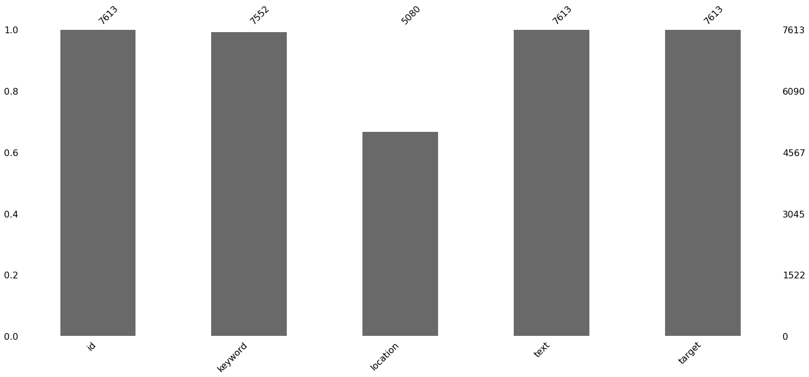
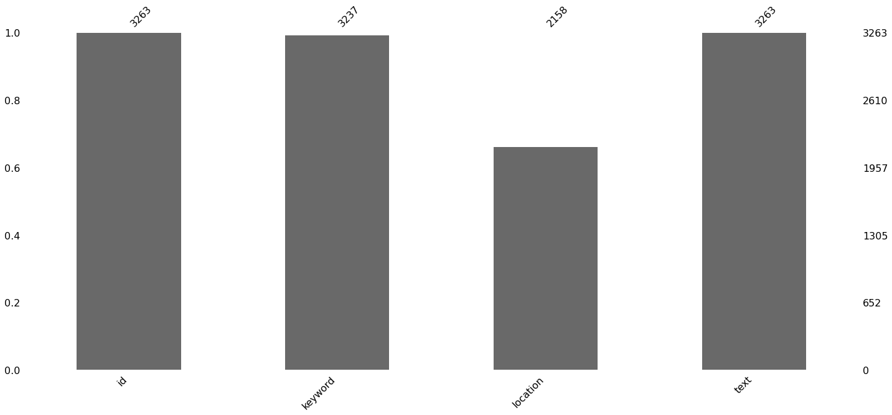
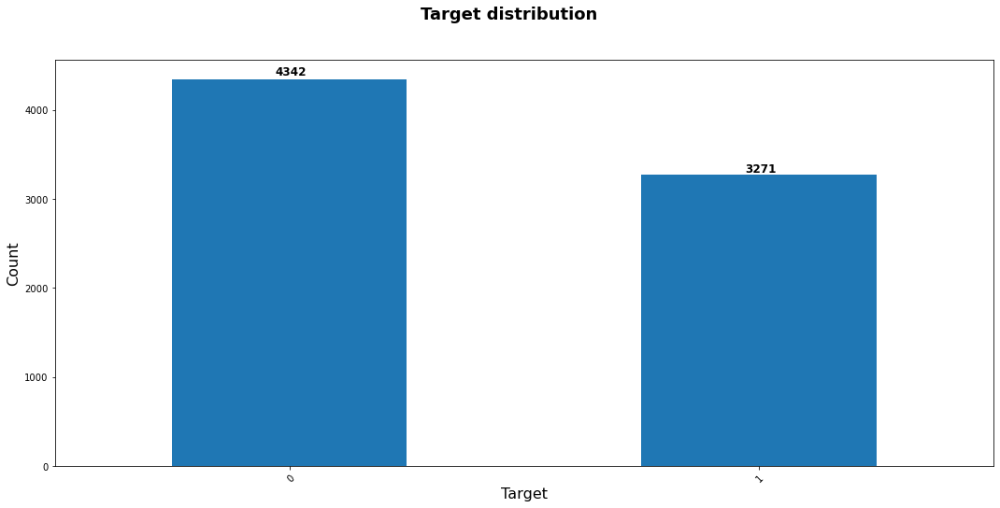

# Disaster_tweet_2

<h1>Table of Contents<span class="tocSkip"></span></h1>
<div class="toc"><ul class="toc-item"><li><span><a href="#Summary" data-toc-modified-id="Summary-1"><span class="toc-item-num">1&nbsp;&nbsp;</span>Summary</a></span></li><li><span><a href="#Loading-packages" data-toc-modified-id="Loading-packages-2"><span class="toc-item-num">2&nbsp;&nbsp;</span>Loading packages</a></span></li><li><span><a href="#Loading-the-data" data-toc-modified-id="Loading-the-data-3"><span class="toc-item-num">3&nbsp;&nbsp;</span>Loading the data</a></span></li><li><span><a href="#Exploring-the-dataset" data-toc-modified-id="Exploring-the-dataset-4"><span class="toc-item-num">4&nbsp;&nbsp;</span>Exploring the dataset</a></span><ul class="toc-item"><li><span><a href="#Missing-values" data-toc-modified-id="Missing-values-4.1"><span class="toc-item-num">4.1&nbsp;&nbsp;</span>Missing values</a></span></li><li><span><a href="#Target-distribution" data-toc-modified-id="Target-distribution-4.2"><span class="toc-item-num">4.2&nbsp;&nbsp;</span>Target distribution</a></span></li></ul></li><li><span><a href="#Preprocessing-:-correcting-typos" data-toc-modified-id="Preprocessing-:-correcting-typos-5"><span class="toc-item-num">5&nbsp;&nbsp;</span>Preprocessing : correcting typos</a></span><ul class="toc-item"><li><span><a href="#Verify-if-cleaning-is-ok" data-toc-modified-id="Verify-if-cleaning-is-ok-5.1"><span class="toc-item-num">5.1&nbsp;&nbsp;</span>Verify if cleaning is ok</a></span></li><li><span><a href="#Apply-cleaning-to-test-set" data-toc-modified-id="Apply-cleaning-to-test-set-5.2"><span class="toc-item-num">5.2&nbsp;&nbsp;</span>Apply cleaning to test set</a></span></li></ul></li><li><span><a href="#Model-Building---Word-Embedding-+-Tensorflow-neural-network" data-toc-modified-id="Model-Building---Word-Embedding-+-Tensorflow-neural-network-6"><span class="toc-item-num">6&nbsp;&nbsp;</span>Model Building - Word Embedding + Tensorflow neural network</a></span><ul class="toc-item"><li><span><a href="#Encoding-the-data" data-toc-modified-id="Encoding-the-data-6.1"><span class="toc-item-num">6.1&nbsp;&nbsp;</span>Encoding the data</a></span></li><li><span><a href="#Downloading-the-embedder" data-toc-modified-id="Downloading-the-embedder-6.2"><span class="toc-item-num">6.2&nbsp;&nbsp;</span>Downloading the embedder</a></span></li><li><span><a href="#Creating-the-neural-network" data-toc-modified-id="Creating-the-neural-network-6.3"><span class="toc-item-num">6.3&nbsp;&nbsp;</span>Creating the neural network</a></span></li><li><span><a href="#Model-training" data-toc-modified-id="Model-training-6.4"><span class="toc-item-num">6.4&nbsp;&nbsp;</span>Model training</a></span></li></ul></li><li><span><a href="#Predictions" data-toc-modified-id="Predictions-7"><span class="toc-item-num">7&nbsp;&nbsp;</span>Predictions</a></span></li><li><span><a href="#Storing-the-predictions-into-an-output-dataframe" data-toc-modified-id="Storing-the-predictions-into-an-output-dataframe-8"><span class="toc-item-num">8&nbsp;&nbsp;</span>Storing the predictions into an output dataframe</a></span></li></ul></div>

# Summary

This is my second take at the [“Real or Not ? NLP with Disaster Tweets” Kaggle competition](https://www.kaggle.com/c/nlp-getting-started/overview).

Last time, I was a rather junior data scientist. I focused heavily on feature engineering and bags of words to put into machine learning model, and managed to obtain a decent score of 78% with ensemble models.

Now, 6 months later, I am more familiar with NLP, and especially with word embeddings, as well as with neural networks. I'll use these more advanced methods to see if I can obtain better scores than last time, and see how far I have progressed.

# Loading packages


```python
%matplotlib inline
import pandas as pd
import numpy as np
import matplotlib.pyplot as plt
from matplotlib import cm
from matplotlib.lines import Line2D
from mpl_toolkits import mplot3d
import nltk
import pandas as pd
import seaborn as sns
import os
import requests
import missingno as msno
import warnings
import re
import time
from spellchecker import SpellChecker
warnings.simplefilter(action='ignore', category=FutureWarning)
from urllib import request
from sklearn.preprocessing import LabelEncoder
import keras
from tensorflow.compat.v1.keras import backend as KB
from keras.layers import Dense, Flatten, Input, Lambda
from keras.models import Model, load_model
from keras import optimizers
from keras.callbacks import EarlyStopping
import tensorflow.compat.v1 as tf
tf.disable_eager_execution()
import tensorflow_hub as hub
```

# Loading the data


```python
test_url = "https://storage.googleapis.com/kagglesdsdata/competitions/17777/869809/test.csv?GoogleAccessId=web-data@kaggle-161607.iam.gserviceaccount.com&Expires=1620373333&Signature=bmy6sGK2iuXzJYweu2NmmSBFEAEf%2Bswtbc8%2F%2F5qs2JLpts0CHjYsbBT1L%2FsykkEj4cWA2iyKTjs7LfGZj3i5bYTZwg2O2ZGA2g2YzA0z9TW7n%2FotxegI%2Bzl%2FpmTTHEJki3NSkNX2tDybv%2BF2KxGsdiGCGyX8Nsm1u6%2Bwd32Il2EIRPgP%2BxZwkw%2FumQ5E7ut7ryzvTxEwWz6XwHNCpjGuT1KVrSQY4%2FrUNiSB4oHJc1H%2BmEgG8i87cFSjtiIyVO2spuxKKc8VhVFaDeSRi7R%2B%2FQ7Knk6ZSXaHgYyMjoZAn65Vg2wm6xcEVQNggYmjUE3nEavepO2X4an1HqOnUSseUg%3D%3D&response-content-disposition=attachment%3B+filename%3Dtest.csv"
train_url = "https://storage.googleapis.com/kagglesdsdata/competitions/17777/869809/train.csv?GoogleAccessId=web-data@kaggle-161607.iam.gserviceaccount.com&Expires=1620373395&Signature=CX3TP4uT7VaGEcy8uVyIadgNJOdP415F4DQgTPTp37vSIJidekF%2FtKotU1VCBVwycS5PWJYbJESblLYpY8rDdiqxt%2BhEEXYWveVmpLJxVtrI%2Bsx3T%2Bh45ruy4t1kBWCY8HQkG3GgJT6TqTvxY0tdk0qMBIVWVwDWNdMHHjR61yr5wIffsqQLV0P3Eil3V%2B9rz4lWaU1uxSgKMbe32ExRPEY%2FrNrkrGKMLlrZi%2BgELWNaIS0RpPBxV%2FCTGlddj3y%2FsrSy900mviTbpxvQB17FchSGy8E%2BgwAdkHmLrMWVFRUMecPuk5TFCIu1kQFrDGHPPIT%2FPWA8EeyvqDn0MynejA%3D%3D&response-content-disposition=attachment%3B+filename%3Dtrain.csv"
if not os.path.exists('data'):
    os.makedirs('data')

if not os.path.exists("./data/train.csv"):
    request.urlretrieve (train_url, "./data/train.csv")
if not os.path.exists("./data/test.csv"):
    request.urlretrieve (test_url, "./data/test.csv")

train_data = pd.read_csv("./data/train.csv")
test_data = pd.read_csv("./data/test.csv")
```

# Exploring the dataset

The datasets look like this :


```python
train_data.head()
```


<div>
<style scoped>
    .dataframe tbody tr th:only-of-type {
        vertical-align: middle;
    }

    .dataframe tbody tr th {
        vertical-align: top;
    }

    .dataframe thead th {
        text-align: right;
    }
</style>
<table border="1" class="dataframe">
  <thead>
    <tr style="text-align: right;">
      <th></th>
      <th>id</th>
      <th>keyword</th>
      <th>location</th>
      <th>text</th>
      <th>target</th>
    </tr>
  </thead>
  <tbody>
    <tr>
      <th>0</th>
      <td>1</td>
      <td>NaN</td>
      <td>NaN</td>
      <td>Our Deeds are the Reason of this #earthquake M...</td>
      <td>1</td>
    </tr>
    <tr>
      <th>1</th>
      <td>4</td>
      <td>NaN</td>
      <td>NaN</td>
      <td>Forest fire near La Ronge Sask. Canada</td>
      <td>1</td>
    </tr>
    <tr>
      <th>2</th>
      <td>5</td>
      <td>NaN</td>
      <td>NaN</td>
      <td>All residents asked to 'shelter in place' are ...</td>
      <td>1</td>
    </tr>
    <tr>
      <th>3</th>
      <td>6</td>
      <td>NaN</td>
      <td>NaN</td>
      <td>13,000 people receive #wildfires evacuation or...</td>
      <td>1</td>
    </tr>
    <tr>
      <th>4</th>
      <td>7</td>
      <td>NaN</td>
      <td>NaN</td>
      <td>Just got sent this photo from Ruby #Alaska as ...</td>
      <td>1</td>
    </tr>
  </tbody>
</table>
</div>


```python
test_data.head()
```


<div>
<style scoped>
    .dataframe tbody tr th:only-of-type {
        vertical-align: middle;
    }

    .dataframe tbody tr th {
        vertical-align: top;
    }

    .dataframe thead th {
        text-align: right;
    }
</style>
<table border="1" class="dataframe">
  <thead>
    <tr style="text-align: right;">
      <th></th>
      <th>id</th>
      <th>keyword</th>
      <th>location</th>
      <th>text</th>
    </tr>
  </thead>
  <tbody>
    <tr>
      <th>0</th>
      <td>0</td>
      <td>NaN</td>
      <td>NaN</td>
      <td>Just happened a terrible car crash</td>
    </tr>
    <tr>
      <th>1</th>
      <td>2</td>
      <td>NaN</td>
      <td>NaN</td>
      <td>Heard about #earthquake is different cities, s...</td>
    </tr>
    <tr>
      <th>2</th>
      <td>3</td>
      <td>NaN</td>
      <td>NaN</td>
      <td>there is a forest fire at spot pond, geese are...</td>
    </tr>
    <tr>
      <th>3</th>
      <td>9</td>
      <td>NaN</td>
      <td>NaN</td>
      <td>Apocalypse lighting. #Spokane #wildfires</td>
    </tr>
    <tr>
      <th>4</th>
      <td>11</td>
      <td>NaN</td>
      <td>NaN</td>
      <td>Typhoon Soudelor kills 28 in China and Taiwan</td>
    </tr>
  </tbody>
</table>
</div>


## Missing values

We can see that we have no missing values for the text and target variables :


```python
msno.bar(train_data)
```


    <matplotlib.axes._subplots.AxesSubplot at 0x1f49ef232e0>





```python
msno.bar(test_data)
```


    <matplotlib.axes._subplots.AxesSubplot at 0x1f49fcd6b80>





## Target distribution

We have the following target distribution, which is rather balanced :


```python
fig, ax = plt.subplots(figsize = (18, 8))
train_data["target"].value_counts().plot(kind = "bar", ax = ax)
plt.xticks(rotation = 45, rotation_mode = "anchor", ha = "right")
for idx, value in enumerate(train_data["target"].value_counts()):
    ax.text(idx - 0.03, value + 0.01*value, value, fontweight = "bold", fontsize = 12)
ax.set_xlabel("Target", fontsize = 16)
ax.set_ylabel("Count", fontsize = 16)
plt.suptitle("Target distribution", fontsize = 18, fontweight = "bold")
```


    Text(0.5, 0.98, 'Target distribution')





# Preprocessing : correcting typos

As our datasets come from tweets, we can expect a fair number of typos.

We'll deal with those thanks to the SpellChecker function from the spellchecker package.


```python
spell = SpellChecker()
```

We'll go through all the rows and list all of the typos


```python
temp_dict = {}
tokenizer = nltk.RegexpTokenizer(r'\w+')
for sentence in train_data["text"]:
    tokenized_sentence = tokenizer.tokenize(sentence)
    misspelled = spell.unknown(tokenized_sentence)
    for word in misspelled:
        # Get the one `most likely` answer

        corrected = spell.correction(word)
        temp_dict[word] = corrected
```

We'll filter out 1 character typos that mainly come from token splits. For example "What's up" will become "what" "s" "up", and "s" will be considered as a typo if we don't filter it.


```python
new_dict = {}
for key in temp_dict.keys():
    if len(key) > 1:
        new_dict[key] = temp_dict[key]
```


```python
new_dict_df = pd.DataFrame()
new_dict_df["key"] = new_dict.keys()
new_dict_df["values"] = new_dict.values()
```


```python
new_dict_df
```


<div>
<style scoped>
    .dataframe tbody tr th:only-of-type {
        vertical-align: middle;
    }

    .dataframe tbody tr th {
        vertical-align: top;
    }

    .dataframe thead th {
        text-align: right;
    }
</style>
<table border="1" class="dataframe">
  <thead>
    <tr style="text-align: right;">
      <th></th>
      <th>key</th>
      <th>values</th>
    </tr>
  </thead>
  <tbody>
    <tr>
      <th>0</th>
      <td>ronge</td>
      <td>range</td>
    </tr>
    <tr>
      <th>1</th>
      <td>sask</td>
      <td>ask</td>
    </tr>
    <tr>
      <th>2</th>
      <td>rockyfire</td>
      <td>rockyfire</td>
    </tr>
    <tr>
      <th>3</th>
      <td>hwy</td>
      <td>why</td>
    </tr>
    <tr>
      <th>4</th>
      <td>cafire</td>
      <td>afire</td>
    </tr>
    <tr>
      <th>...</th>
      <td>...</td>
      <td>...</td>
    </tr>
    <tr>
      <th>10539</th>
      <td>5uecmcv2pk</td>
      <td>5uecmcv2pk</td>
    </tr>
    <tr>
      <th>10540</th>
      <td>rqkk15uhey</td>
      <td>rqkk15uhey</td>
    </tr>
    <tr>
      <th>10541</th>
      <td>nf4iculoje</td>
      <td>nf4iculoje</td>
    </tr>
    <tr>
      <th>10542</th>
      <td>stfmbbzfb5</td>
      <td>stfmbbzfb5</td>
    </tr>
    <tr>
      <th>10543</th>
      <td>ymy4rskq3d</td>
      <td>ymy4rskq3d</td>
    </tr>
  </tbody>
</table>
<p>10544 rows × 2 columns</p>
</div>


We get 10544 typos, and most of them are gibberish that need to be deleted rather than corrected. 

Here, we can either :

* Manually sort through the typo dictionnary and differenciate typos from gibberish
* Delete everything that is considered a typo

Professionnaly, I would rather pursue the first solution, but here I'll save time and choose the second.


```python
# Save the typo df for later use
new_dict_df.to_csv(r"./data/new_dict_df.csv")
```

Here's what we want to do. If we see a sentence that contains a typo, we want it gone :


```python
temp_sentence = "we want 5n4husewly as president"
```


```python
for key in new_dict_df["key"].values:
    
    if key in temp_sentence :
        temp_sentence = temp_sentence.replace(key, "")
        temp_sentence = temp_sentence.replace("  ", " ")
```


```python
temp_sentence
```


    'we want as president'


We'll create a textclean function and pass it to the tokenized dataset :


```python
train_data["tok_text"] = train_data["text"].apply(lambda X: tokenizer.tokenize(X))
```


```python
def textclean(token_list):
    output = ""
    for token in token_list:
        if token not in new_dict_df["key"].values:
            output += " "+ token
    return(output)
```


```python
train_data["clean_text"] = train_data["tok_text"].apply(textclean)
```

## Verify if cleaning is ok

We'll check if there is any typo that has passed the filter :


```python
train_data["clean_tok_text"] = train_data["clean_text"].apply(lambda X: tokenizer.tokenize(X))
```


```python
test_dict = {}
for key in new_dict.keys():
    test_dict[key] = train_data["clean_tok_text"].apply(lambda X : key in X).sum()
```


```python
pd.DataFrame().from_dict(test_dict, orient = "index")
```


<div>
<style scoped>
    .dataframe tbody tr th:only-of-type {
        vertical-align: middle;
    }

    .dataframe tbody tr th {
        vertical-align: top;
    }

    .dataframe thead th {
        text-align: right;
    }
</style>
<table border="1" class="dataframe">
  <thead>
    <tr style="text-align: right;">
      <th></th>
      <th>0</th>
    </tr>
  </thead>
  <tbody>
    <tr>
      <th>ronge</th>
      <td>0</td>
    </tr>
    <tr>
      <th>sask</th>
      <td>0</td>
    </tr>
    <tr>
      <th>rockyfire</th>
      <td>0</td>
    </tr>
    <tr>
      <th>hwy</th>
      <td>0</td>
    </tr>
    <tr>
      <th>cafire</th>
      <td>0</td>
    </tr>
    <tr>
      <th>...</th>
      <td>...</td>
    </tr>
    <tr>
      <th>5uecmcv2pk</th>
      <td>0</td>
    </tr>
    <tr>
      <th>rqkk15uhey</th>
      <td>0</td>
    </tr>
    <tr>
      <th>nf4iculoje</th>
      <td>0</td>
    </tr>
    <tr>
      <th>stfmbbzfb5</th>
      <td>0</td>
    </tr>
    <tr>
      <th>ymy4rskq3d</th>
      <td>0</td>
    </tr>
  </tbody>
</table>
<p>10544 rows × 1 columns</p>
</div>


```python
np.array(list(test_dict.values())).sum()
```


    0


We deleted them all

## Apply cleaning to test set


```python
test_data["tok_text"] = test_data["text"].apply(lambda X: tokenizer.tokenize(X))
```


```python
test_data["clean_text"] = test_data["tok_text"].apply(textclean)
```

# Model Building - Word Embedding + Tensorflow neural network

I like my data to be called X/y train/test so i'll rename it here :


```python
X_train = train_data["clean_text"].to_numpy()
y_train = train_data["target"].to_numpy()
X_test = test_data["clean_text"].to_numpy()
```

## Encoding the data


```python
le = LabelEncoder()
le.fit(y_train)
```


    LabelEncoder()


```python
def encode(le, labels):
    enc = le.transform(labels)
    return keras.utils.to_categorical(enc)

def decode(le, one_hot):
    dec = np.argmax(one_hot, axis = 1)
    return(le.inverse_transform(dec))
```

i'll only encode the response variable but i'll keep the names unified, so i'll also rename X_train into an encoded variable


```python
X_train_enc = X_train
y_train_enc = encode(le, y_train)
```

## Downloading the embedder

We'll use Google's Universal Sentence Encoder


```python
module_url = "https://tfhub.dev/google/universal-sentence-encoder/2" 
embed = hub.Module(module_url)
```

## Creating the neural network


```python
def UniversalSentenceEncoding(x):
    return embed(tf.squeeze(tf.cast(x, tf.string)))
```


```python
input_layer = Input(shape = (1,), dtype = tf.string)
embedding_layer = Lambda(UniversalSentenceEncoding, output_shape = (512,))(input_layer)
dense_layer = Dense(256, activation = "relu")(embedding_layer)
dense_layer_2 = Dense(128, activation = "relu")(dense_layer)
prediction_layer = Dense(2, activation = "softmax")(dense_layer_2)

nlp_model = Model(inputs = [input_layer], outputs = prediction_layer)
```

    INFO:tensorflow:Saver not created because there are no variables in the graph to restore
    

    INFO:tensorflow:Saver not created because there are no variables in the graph to restore
    


```python
nlp_model.summary()
```

    Model: "model"
    _________________________________________________________________
    Layer (type)                 Output Shape              Param #   
    =================================================================
    input_1 (InputLayer)         [(None, 1)]               0         
    _________________________________________________________________
    lambda (Lambda)              (None, 512)               0         
    _________________________________________________________________
    dense (Dense)                (None, 256)               131328    
    _________________________________________________________________
    dense_1 (Dense)              (None, 128)               32896     
    _________________________________________________________________
    dense_2 (Dense)              (None, 2)                 258       
    =================================================================
    Total params: 164,482
    Trainable params: 164,482
    Non-trainable params: 0
    _________________________________________________________________
    


```python
nlp_model.compile(loss='categorical_crossentropy', optimizer = "adam", metrics=["accuracy"])
callback = EarlyStopping(monitor='val_loss', patience=5, min_delta = 0.0001, restore_best_weights = True)
```

## Model training


```python
start_clock = time.time()
with tf.Session() as session:
    KB.set_session(session)
    session.run(tf.global_variables_initializer())
    session.run(tf.tables_initializer())
    training_session = nlp_model.fit(X_train_enc, y_train_enc, epochs = 50, batch_size = 50, verbose=2, 
                                     validation_split = 0.3, callbacks = [callback])
    nlp_model.save_weights("./data/nlp_model.h5")
print("Model trained in {}s".format(round(time.time() - start_clock)))
```

    Train on 5329 samples, validate on 2284 samples
    Epoch 1/50
    

    C:\Users\Antoine\anaconda3\lib\site-packages\tensorflow\python\keras\engine\training.py:2325: UserWarning: `Model.state_updates` will be removed in a future version. This property should not be used in TensorFlow 2.0, as `updates` are applied automatically.
      warnings.warn('`Model.state_updates` will be removed in a future version. '
    

    5329/5329 - 2s - loss: 0.4741 - accuracy: 0.7958 - val_loss: 0.3873 - val_accuracy: 0.8363
    Epoch 2/50
    5329/5329 - 1s - loss: 0.4133 - accuracy: 0.8208 - val_loss: 0.4043 - val_accuracy: 0.8222
    Epoch 3/50
    5329/5329 - 1s - loss: 0.3869 - accuracy: 0.8341 - val_loss: 0.3832 - val_accuracy: 0.8358
    Epoch 4/50
    5329/5329 - 1s - loss: 0.3678 - accuracy: 0.8454 - val_loss: 0.3916 - val_accuracy: 0.8306
    Epoch 5/50
    5329/5329 - 1s - loss: 0.3373 - accuracy: 0.8568 - val_loss: 0.3963 - val_accuracy: 0.8297
    Epoch 6/50
    5329/5329 - 1s - loss: 0.2972 - accuracy: 0.8760 - val_loss: 0.4287 - val_accuracy: 0.8257
    Epoch 7/50
    5329/5329 - 1s - loss: 0.2583 - accuracy: 0.9007 - val_loss: 0.4954 - val_accuracy: 0.8126
    Epoch 8/50
    5329/5329 - 2s - loss: 0.2120 - accuracy: 0.9186 - val_loss: 0.5132 - val_accuracy: 0.8139
    Model trained in 23s
    

# Predictions


```python
with tf.Session() as session:
    KB.set_session(session)
    session.run(tf.global_variables_initializer())
    session.run(tf.tables_initializer())
    nlp_model.load_weights('./data/nlp_model.h5')
    predictions = nlp_model.predict(X_test, batch_size = 100)
```


```python
predictions
```


    array([[0.46936506, 0.530635  ],
           [0.05135619, 0.94864386],
           [0.395157  , 0.60484296],
           ...,
           [0.08381163, 0.91618836],
           [0.3284883 , 0.67151177],
           [0.3370069 , 0.66299313]], dtype=float32)


```python
y_predictions = decode(le, predictions)
```


```python
y_predictions
```


    array([1, 1, 1, ..., 1, 1, 1], dtype=int64)


# Storing the predictions into an output dataframe


```python
output = pd.DataFrame()
```


```python
output["id"] = test_data["id"]
output["target"] = y_predictions
```


```python
output.head()
```


<div>
<style scoped>
    .dataframe tbody tr th:only-of-type {
        vertical-align: middle;
    }

    .dataframe tbody tr th {
        vertical-align: top;
    }

    .dataframe thead th {
        text-align: right;
    }
</style>
<table border="1" class="dataframe">
  <thead>
    <tr style="text-align: right;">
      <th></th>
      <th>id</th>
      <th>target</th>
    </tr>
  </thead>
  <tbody>
    <tr>
      <th>0</th>
      <td>0</td>
      <td>1</td>
    </tr>
    <tr>
      <th>1</th>
      <td>2</td>
      <td>1</td>
    </tr>
    <tr>
      <th>2</th>
      <td>3</td>
      <td>1</td>
    </tr>
    <tr>
      <th>3</th>
      <td>9</td>
      <td>1</td>
    </tr>
    <tr>
      <th>4</th>
      <td>11</td>
      <td>1</td>
    </tr>
  </tbody>
</table>
</div>


```python
output.to_csv(r"./data/output3.csv", index = False, header = True)
```

According to Kaggle's evaluation, we get a score of 0.81949 , which puts us at a very high position !
